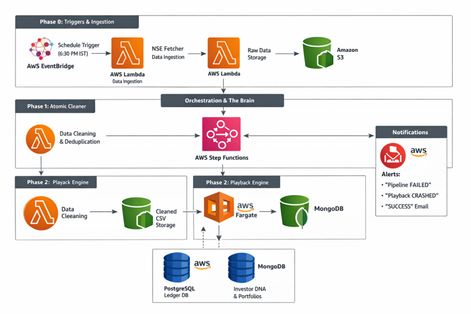

# The Verity Case Study: Why We Built It, and How It Thinks

> This is a plain-language walkthrough of the problem Verity solves and the reasoning behind how it's built — no code, no setup steps. For that, see [`README.md`](./README.md).

---

## The Problem, In One Line

Big investors (banks, mutual funds, large institutions) leave a public paper trail every time they make a big trade. Almost nobody reads it, because it's messy. Verity reads it for you.

---

## 1. The Problem

Every time a large institution — a mutual fund, a bank, a big investor — makes a large trade on the Indian stock market, it has to be reported. This is called a **"bulk deal,"** and the record is public. Anyone can look it up.

In theory, that means a regular retail investor has access to the same information as a professional fund manager. In practice, they don't — and here's why:

- The same fund can show up under many different names in the data. "HDFC Mutual Fund," "HDFC MF," and "HDFC ASSET MGMT CO." might all be the same company, but a computer (or a person) reading the raw file has no way of knowing that automatically.
- A lot of the "big" trades in the data aren't really meaningful. Someone might buy a huge number of shares in the morning and sell the exact same number that afternoon, just to make a quick profit. That's noise, not a real investment decision.
- On a single day, this data can have over 10,000 rows. No person can read through that by hand and spot a pattern.
- By the time someone *does* spot a pattern manually, the stock price has usually already moved. The opportunity is gone.

So the information isn't secret. It's just too messy and too large for a person to use in time for it to matter. That gap — between "public" and "usable" — is the whole problem Verity was built to close.

---

## 2. The Idea

Instead of trying to predict where a stock price will go — which is basically guessing — Verity does something more grounded:

> **Find the investors who have a strong track record, and pay attention to what they're doing right now.**

This is a deliberate choice. Verity isn't a fortune teller. It doesn't read the news, it doesn't look at social media, and it doesn't try to be smarter than the market. It just does something very few people have the time to do: carefully read *everything* the big players are doing, cross-check it against their own history, and flag the moments that actually matter.

Think of it like this — you don't need to be a stock expert to benefit from knowing that three separate, historically successful funds have all quietly bought into the same company this month. That's useful information on its own. Verity's job is to notice that and tell you.

---

## 3. Building a "Digital Twin" of Every Investor

The central idea inside Verity is something we call a **Digital Twin.**

A Digital Twin is just a live, accurate copy of what a real investor's portfolio looks like — how many shares they hold, at what average price, and how that's changed over time. Instead of just logging "Fund X bought Stock Y," Verity keeps a running, share-by-share model of that fund's entire holding, as if you had a private window into their account.

For this copy to actually be useful, it has to be right. Not "roughly right" — exactly right. That depends on three things:

**a) It has to track real shares, not just trade records.**
If a company gives out free bonus shares, or splits each share into two, an investor's holding changes even though they didn't buy or sell anything. If Verity's twin doesn't know about this, its numbers quietly become wrong — and everything built on top of those numbers becomes wrong too.

**b) It has to be based on facts, not guesses.**
Every single number in the twin traces back to a real, verified transaction — never a rumor, a tip, or a guess. We call this the **Truth Ledger**: a permanent, append-only record of every confirmed trade. If we can't prove something happened, it doesn't go in.

**c) Only once it's accurate can it be useful.**
Once we trust that the twin is correct, we can safely start asking interesting questions of it — like "is this investor's current move consistent with how they usually behave?" Skip step (a) or (b), and step (c) is just guessing with extra steps.

---

## 4. Fixing the "Same Person, Different Name" Problem

This is one of the most common — and most underrated — ways this kind of system breaks.

**The problem:** the same fund can appear in the raw data under several different spellings. If Verity treats "HDFC Mutual Fund" and "HDFC MF" as two separate investors, it doesn't just create a small labeling error — it actually hides the real pattern. Instead of seeing "one large fund made a big move," the system sees "two smaller funds each made a small move," and the signal disappears.

**The fix:** before any calculations happen, every investor name gets matched against a master list of known aliases and merged into a single identity. This step happens early on purpose — everything downstream (scores, rankings, signals) depends on getting this right first.

---

## 5. Telling Investors Apart from Day-Traders

Not every big trade means something. A large chunk of daily "bulk deal" volume is just someone buying a large number of shares in the morning and selling them by the afternoon — a quick, same-day trade with no real conviction behind it. If Verity treated that the same as a genuine long-term investment, it would be constantly distracted by noise.

**The fix:** Verity checks each investor's *net* position for the day. If someone bought and sold the same amount of the same stock on the same day, their net change is zero, and the system ignores it. What's left, after this filter, is trades that represent someone actually choosing to hold a position — which is the only kind of activity Verity cares about.

---

## 6. Getting the Math Right (Even When It's Annoying)

Two accounting details are easy to overlook, but if you get them wrong, every number the system produces afterward is wrong too. Verity treats both as mandatory, not optional.

**a) Which shares did they actually sell?**

Imagine an investor bought some shares in January at ₹100, bought more in June at ₹200, and then sold half their total position in December. Which shares did they sell — the cheap ones or the expensive ones? The answer changes their profit completely.

Verity answers this with a simple, standard accounting rule called **FIFO — First In, First Out.** Picture a grocery store: the oldest milk on the shelf gets sold first. In the same way, Verity always assumes the *oldest* purchased shares are the ones being sold first. It's not a guess — it's a consistent rule applied every time, so the profit numbers are always calculated the same, correct way.

**b) What happens when a company changes the number of shares you hold?**

Sometimes a company will split its stock (say, turning every 1 share into 2) or hand out free "bonus" shares. The investor didn't buy or sell anything, but their share count and cost basis both changed.

Picture a pizza that gets cut into more slices. You now have more slices, but you don't have more pizza — the total value is the same, just divided differently. If Verity's twin doesn't account for this, it would look like the investor's holding suddenly "lost half its value" the moment the stock price adjusts for the split — which is completely wrong. So every known stock split or bonus issue is automatically applied to the twin, keeping the share count and cost basis correct through the investor's entire history.

Skipping either of these isn't a small shortcut — it silently poisons every score and signal built on top of it later. That's why Verity treats this as foundational, not a "nice to have."

---

## 7. Turning Data Into an Actual Decision

Having an accurate twin for every investor is a good start, but on its own it's still just a big database. Most people don't want to browse a database — they want a straight answer to "is this worth my attention right now?"

That's the job of Verity's **Signal Engine.** Every time a new trade comes in, four independent checks run on it at the same time, each looking for a different kind of pattern:

| Check | What it's looking for, in plain terms |
|---|---|
| **Institutional Herding** | Are several different, independent funds all buying into the same stock around the same time? |
| **Whale Conviction** | Is a fund buying *more* of a stock it already owns, even at a noticeably higher price than what it paid before? That usually means real confidence, not just cheap buying. |
| **Relative Volume Intensity** | Is this trade unusually large compared to how this stock normally trades? |
| **Whale Exit** | Is a fund with a strong track record selling out of a position? This is the warning-sign equivalent of the above. |

No single check is trusted by itself. Their results are combined into one overall score, and only the trades that get strong agreement from more than one check get shown to the user — each labeled with how confident the system is: **Speculative → Moderate → High → Critical.**

Underneath all four checks is a **Smart Money Score** for every investor — a running measure of how often they've been right, how big their wins have been, how long they typically hold a position, and how diversified they are across sectors. A group of mediocre, historically inconsistent traders piling into a stock means a lot less than two or three consistently successful investors quietly doing the same thing, and the scoring is built to reflect that difference.

---

## 8. What Verity Deliberately Doesn't Do

Being clear about the limits of the system is as important as describing what it does.

- **It doesn't predict the future.** No news headlines, no social media sentiment, no macroeconomic forecasting. Every signal is based on trades that have already happened and been verified — Verity reports what *has* happened, not what it *thinks will* happen.
- **It doesn't trade on your behalf.** Verity gives you information — scores, signals, risk context — but it never places a trade automatically. The decision is always yours.
- **It's not a "hot tip" generator.** Every number Verity shows you can be traced back to a specific transaction from a specific investor. If a signal can't be explained by real data, it doesn't get shown.

---

## 9. The End Result

The goal, after all of this engineering, is simple: let a regular investor see the market the way a professional research desk would — who's quietly buying, who's quietly selling, and how much confidence to place in each move — without ever needing to look at a single row of raw data themselves.

That's what the dashboard is for: taking 13,000+ rows of daily noise and boiling it down to the handful of things actually worth a decision.

---

## In One Sentence

**Verity doesn't try to guess where the market is going — it builds a truthful, mathematically accurate copy of what the most successful investors are already doing, and tells you exactly how much to trust each move.**

---

## Appendix: The Original Design Concept

Before Verity's current architecture (documented in [`README.md`](./README.md#architecture)), the very first version of this system was sketched out as an all-AWS, serverless pipeline. It's included below purely for historical context — it's **not** what Verity runs on today, but the underlying ideas — trade on a fixed schedule, clean the data before anything touches the database, keep a strict "ledger" separate from a fast "read" copy, and alert automatically if anything fails — are the same ones the current system still follows, just on different infrastructure.

*Scheduled trigger → automated data fetch → raw storage → orchestrated cleaning stage → parallel writes to a permanent ledger database and a fast-read portfolio database, with automated alerts on success or failure.*